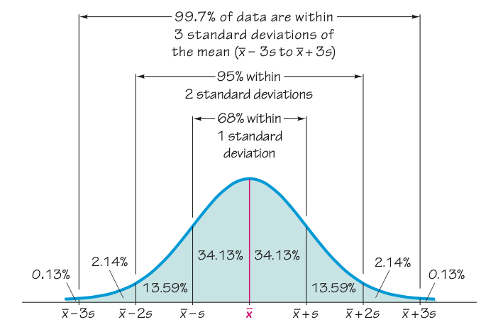

# Lecture 1
---
## Definitions:

- **Statistics** is the `science` of `planning studies` and `experiments`; `obtaining data`; and then `organizing`, `summarizing`, `presenting`, `analyzing`, and `interpreting`  those data then drawing conclusion based on them.
- **Population**  is the complete collection of all measurements or data that are being considered. 
- A **Census** is the collection of data from every member of the population 
- A **sample** is a sub-collection of members selection from a population 
  - **Voluntary response sample** subjects decide themselves to be included in the sample 
    - Internet pools, mail-in pools, telephone call-in pools
  - **Random sample** each member of population has equal probability of bring selected. 
  - **Simple Random Sample** each sample of size n has equality ob being chosen. 
  - **Systematic sampling** after starting point, select every k-th member. 
  - **Stratified sampling** divide population into subgroups such that subject within groups have same characteristics, then draw a random sample from each group. 
  - **Cluster sampling** Divide population into clusters then randomly select some of these clusters. 
  - **Convenience sampling** easily available results. 
- **Variable** varying quantity in cause and effect studies. 
  - **Response (depended) variable:** representing the effect to study. 
  - **Explanatory (independent) variable:** possibly causing the effect. 
  - **Confounding:** mixing influence of several explanatory variables or response 
- **Study:**
  - **Observation study:** characteristics of subjects are observed; subjects are not modified. 
    - **Retrospective** case - control, data from past
    - **Cross-sectional** data from one point in time
    - **Prospective** longitudinal, data to be collected 
  - **Experiment**: Some subject treatment 
    - Sometimes control and treatment group: single-blind or double-blind, 
    - To measure placebo effect or experimental effect. 
- **Data:** are collections of observations, such as measurements, genders, or survey results. 
  - Parameter: numerical measurement describing a population's. `Notation:` generally greek symbols,e.g. π, µ 
  - Statistics: Numerical measurement describing a sample's characteristics. `notation` small latters, e.g. x, s. 
  - **Data types:**
    - **Qualitative(categorical)** names or labels represent counts or measurements - good/fair/bad 
      - Level of measurements: 
        - **Nominal** names, labels, categories (no order)
        - **Ordinal** categories with orderings - , grade 
    - **Quantitative(numerical)** numbers represent counts or measurements. - 1, 0, 2,5
      - **Discrete:** the set of possible values is countable - number of siblings  
      - **Continuous:** the set of possible values in uncountable - weight of oldest sibling  
    - Level of measurements:  
      - **Interval** ordering possible and meaningful difference - year of birth, temperature 
      - **ratio** ordering possible and meaningful differences and starting point - body length, 
## Summarizing data

Choose summery based on the research question. We are often interested in `Data Distribution`.  
**Characteristics of Data Distribution**  
- Location, spread, range, extreme, accumulation, gaps, symmetry. 
    
**Summarizing**
- **Graphical** - tables, graphs and figures 
  - **Frequency distribution:** count occurrences of category. `Cumulative frequencies` and `relative (cumulative) frequencies`
  - **Bar Chart & Cumulative Bar chart.**
  - **Pareto chart:** categories ordered w.r.t. frequency. Required: data of nominal measurement level!
  - **Pie Chart** Pie piece sizes determined by relative frequency of category. (Mainly: qualitative data)
  - **Histogram:** bar areas are proportional to frequency in respective interval. Differences in histograms are caused by the number of cells (intervals) and the location of the bins.
  - **Time series plot:** visualization of time-varying quantity.
  - **Box plot:** 5 number summary. Highest value: maximum, top of box: third quartile, Q3, Thick line: median, Q2, Bottom of box: Q1, Lowest value: minimum, 
    - Whiskers: lines extending from the box.
    - Outliers: all points not included between whiskers.
- **Descriptive** - 
  - **Quantitative** - describe shape, location and dispersion/variation 
    - **Shape:** make smooth approximation of histogram. Symmetrical, uniformed, right-skewed. 
    - **Location:** data distribution can also be described by location (position on x axis).
  - **Qualitative** - numerical summaries of location and variation
    - **Dispersion (spread/variation):** measure of variation within dataset. Same shape & location, but different dispersion
    - **Measure of Centre:** A measure of center is a value at the center or middle of a data set.
      - **Mean** is the ”average”. The mean of a data set uses every data value. Dis advantage of the mean is it can get skewed due to outliers. mean =  
        - Sample mean,  with n the sample size.
        - Population mean, µ with N the population size.
      - **Median** is the ”middle” value of the data set (after sorting). Median doesn't use all the data. it doesn't get skewed dur to outliers.  
      - **Mode** is the value that occurs with highest frequency. unique mode: unimodal, else bimodal (2) / multimodal (>2 modes).
    - **Measure of variation:** 
      -
      - **standard deviation:** common measure of variation.
It measures how much the values deviate from the mean.  population standard deviation is denoted by σ and sample with s, 
      - **Variance:** mean quadratic deviation from the sample mean. population variance is denoted by σ2 and sample with s2 
      - **range:** maximum - minimum
      - **Percentile Pi:** i % of data values is smaller than Pi and (100−i)% is larger than Pi .
Special percentiles: **quartiles Q1, Q2 & Q3**.
These divide the data set into four groups of ≈ 25% of data values each.
        - Q1 = P25: first quartile
        - Q2 = P50 = median: second quartile 
        - Q3 = P75: third quartile

**Notes:**
- **Empirical Rule:** About 68% of all values fall within 1 standard deviation, 97% of values in 2 standard deviation and about 99.7% in 3 standard deviations. 
- 

## Questions
### Section 1.2
  **3:** What is a `voluntary response sample`, and why is such a sample generally not suitable for a statistical study.  
  **Ans**: When the subject participate the experiment willingly, its called voluntary response sample. This sampling method is seriously flawed because we can only conclude result from a particular group of people who has biasness on the survey by voluntary participating on it.  
  **4:** Correlation and Causation What is meant by the statement that `correlation does not imply causation`?  
  **Ans** Correlation is a statistical technique which tells us how strongly the pair of variables are linearly related and change together. However, it does not tell us why and how behind the relationship but it just says the relationship exists. For corelation between sunglass sale and ice cream sold.  
  **37:** ATV Accidents The Associated Press provided an article with a headline stating that ATV accidents killed 704 people in the last year. The article noted that this is a new record high and compares it to 617 ATV deaths the year before that. Other data about the frequen- cies of injuries were included. What important value was not included? Why is it important?  
  **Ans:**  Without our knowing anything about the number of ATVs
in use, or the number of ATV drivers, or the amount of ATV usage, the number of 740 fatal accidents has no context. Some information should be given so that the reader can understand the rate of ATV fatalities.  
**39** What’s Wrong with This Picture? The Newport Chronicle ran a survey by asking read- ers to call in their response to this question: “Do you support the development of atomic weap- ons that could kill millions of innocent people?” It was reported that 20 readers responded and that 87% said “no,” while 13% said “yes.” Identify four major flaws in this survey.  
**Ans:** The wording of the question is biased and tends to encourage negative responses. The sample size of 20 is too small. Survey respondents are self-selected instead of being selected by the newspaper. If 20 readers respond, the percentages should be multiples of 5, so 87% and 13% are not possible results.

### Section 1.3	 
**5:** Distracted Driving In a AAA Foundation for Traffic Safety survey, 21% of the respon- dents said that they recently texted or e-mailed while driving. determine whether the given value is a statistic or a parameter.  
**Ans:**   Statistic  
**7:** Titanic A study was conducted of all 2223 passengers aboard the Titanic when it sank. determine whether the given value is a statistic or a parameter.   
**Ans:** Parameter   
**29:** Political Parties In a preelection survey of likely voters, political parties of respondents are identified as 1 for a Democrat, 2 for a Republican, 3 for an Independent, and 4 for any- thing else. The average (mean) is calculated for 850 respondents and the result is 1.7. identify the level of measurement of the data. Also, explain what is wrong with the given calculation.  
**Ans:** The numbers are not counts or measures of anything, so they are at the nominal level of measurement, and it makes no sense to compute the average (mean) of them.
### section 1.4	
9, 11, 13, 15, 23, 27, 29  